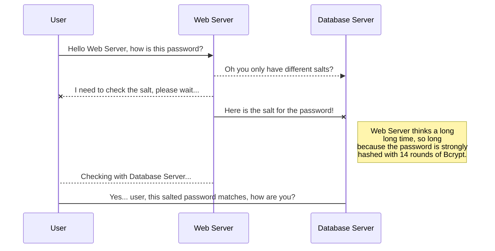
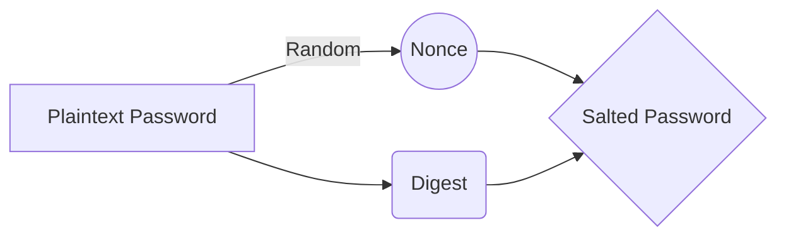

# Welcome to the VERBOSE OCTO LAMP API!

Here we navigate the shadowy worlds of API engineering.

# Basic Authentication

All web applications need strong security so our app features **Basic Authentication**, providing us with some nifty user safety.

> **A scheme :**  where the client sends **HTTP requests** the **Authorization header** with the word **Basic** followed by a space and a base64-encoded string username:password.

## Salted Hashing

We can store passwords securely using [salts](https://en.wikipedia.org/wiki/Salt_(cryptography)).

And this will produce a flow chart:

# Welcome to the Unnamed API!

Here we navigate the shadowy worlds of API engineering.

# Basic Authentication

All web applications need strong security so our app features **Basic Authentication**, providing us with some nifty user safety.

> **A scheme :**  where the client sends **HTTP requests** the **Authorization header** with the word **Basic** followed by a space and a base64-encoded string username:password.

## Salted Hashing

We can store passwords securely using [salts](https://en.wikipedia.org/wiki/Salt_(cryptography)).

And this will produce a flow chart:

